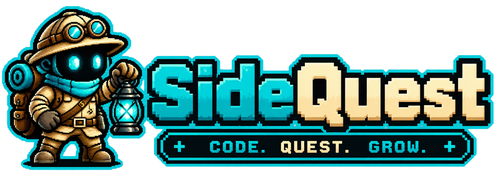
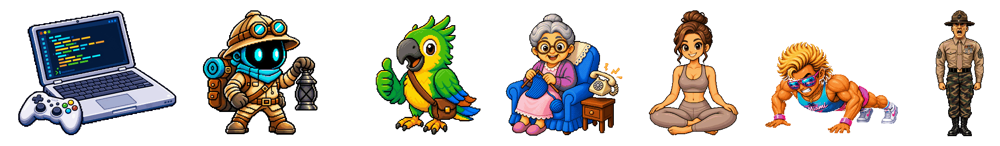
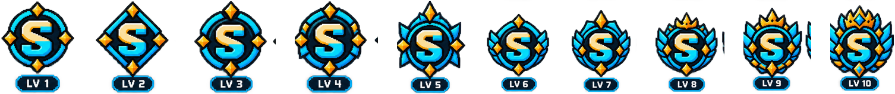
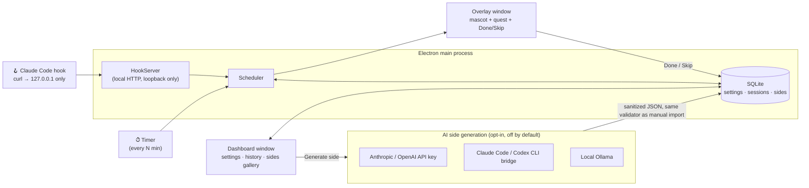

<p align="center">
  
  <br>
  <strong>SideQuest — an idle-time marketplace: micro-quests for your desktop while AI is coding</strong>
</p>

<p align="center">
  <a href="LICENSE"></a>
  <a href="../../releases"></a>
</p>

<p align="center">
  
</p>

SideQuest started as a simple idea: get up and stretch while waiting on a build, a test run, or an AI response. It has since grown into a general-purpose idle-time quest marketplace — plan any kind of quick activity, not just fitness, for the small pockets of downtime in your day.

SideQuest sits in your tray and pops up a mascot with a quick micro-quest whenever you've been idle for a while — or, if you're running Claude Code, exactly when Claude finishes answering and you're staring at the screen waiting on nothing. It's built to grow into a marketplace of idle-time quests, not just one: whatever fits in 30 seconds between two prompts, including quests proposed by the community down the line. See the [Roadmap](#roadmap--major-next-steps) below.

### The quest sides

| Side | Status | |
|---|---|---|
| 🏋️ **SideGym** — fitness | ships today | **You ship code. Your body ships pain.** Stand up. Stretch your back. Shake out your legs. It takes 30 seconds and your body will stop screaming at you by 6pm. |
| 🐱 **SideCat** — look after your cat | ships today | **Your cat exists even when you're coding.** A pet, a bowl, 30 seconds. It grows with your streak, not your guilt. |
| 🐣 **SidePet** — grow a pet | ships today | **Your pet doesn't judge your commits, it grows with them.** 30 seconds, one more level. |
| 🦜 **SideParrot** — language learning | ships today | **You ship code. Your vocabulary ships rust.** One phrase, one flashcard, one rep while the build runs. It takes 30 seconds and that language you keep meaning to learn actually sticks. |
| 🧘 **SideYoga** — relaxation | ships today | **You ship code. Your shoulders ship tension.** Breathe. Unclench your jaw. Roll your neck. It takes 30 seconds and you'll stop carrying your inbox in your spine. |
| 🎮 **SideCodingGame** — coding practice | ships today | **You ship code. Your skills ship rust.** One kata, one riddle, one rep while the tests run. It takes 30 seconds and you'll actually remember it next time you need it. |
| 🧓 **SideGrandma** — check in on your grandma | ships today | **Your commits ship. Your calls to mamie don't.** A text, a call, 30 seconds between two prompts. She won't remember your last PR, but she'll remember you thought of her. |

All 7 bundled sides ship in the app today. Build your own from scratch, import a JSON file, or generate one with AI right from the sides gallery — see below.

## Mascots



The mascot is the face of a quest: it's what shows up in the popup every time one fires. Each side can carry its own — SideGym's Arnold, SideGrandma's grandma, SideParrot's parrot — or leave it unset and fall back to a default: SideCat and SidePet have none of their own yet, so they fall back to whichever global mascot matches your current visual skin, while a custom/imported/generated side falls back to the default SideQuest mascot regardless of skin, so it never looks like it's wearing someone else's costume.

**Using a custom mascot:** open a side in the dashboard's editor and pick one from the mascot row — any of the built-in mascots (including the plain SideQuest one), or your own. Hit **+ Add** to upload a PNG/JPG/WebP (up to 3 MB, 2048×2048px) through the native file picker; it's copied locally and tied to that side from then on. Clicking the mascot that's already active clears it back to the default. This picker is only available on your own sides — a bundled one (SideGym...) keeps its mascot locked.

Generating a side with AI has an optional mascot field too: describe the look you're picturing and the AI hands back a one-line text idea to guide you — no image is generated (no provider used here can produce one), so you still pick or upload the actual picture yourself afterward.

## Badges



Every side tracks its own XP and levels up as you complete quests — one badge per 100 XP, from LV 1 to LV 10. The overlay always shows a preview of the next badge to unlock, with a small progress bar ticking up as you rack up sessions; the dashboard's sides gallery shows every badge you've already earned on that side.

## How it works

- A **timer** fires every N minutes (configurable) and shows a mascot with a random quest from your active side.
- A **Claude Code hook** (optional) fires instead of or alongside the timer — at the end of Claude's response, at the start of your turn, or only if Claude is still working after a few seconds. No API keys, no network calls: just a local HTTP hook SideQuest installs into `~/.claude/settings.json` for you.
- Three modes: **soft notification** (skip whenever), **hard gate** (can't dismiss without doing the quest — this can also hold your Claude Code hook open until you're done), or **mixed** (soft until you rack up a debt of skipped sessions, then it gates).
- A **sides gallery** in the dashboard: browse the bundled sides, build your own from scratch, import a JSON file, or **generate one with AI** — your own Anthropic/OpenAI API key, the Claude Code/Codex CLI you already have installed (no key ever touches the app), or a fully local Ollama model, all optional and off by default. Only one side is active at a time; each tracks its own XP and level as you use it. Export/import as JSON to share a side with someone else.
- Give any side **its own mascot** right in its editor — pick one of the bundled ones or upload your own image, no JSON editing needed.

### Architecture



Everything above the `AI` box runs 100% local, no network calls — SQLite on disk, a loopback-only HTTP server for the Claude Code hook. The only opt-in exception is AI side generation, which is off until you configure a provider in Settings.

If it saves your back even once, [leave a star](../../) — it helps other Claude Code users find this.

## Install

Download the latest build from the [**Releases**](../../releases) page:

| OS | File |
|---|---|
| macOS | `SideQuest-x.x.x-mac-arm64.dmg` (Apple Silicon) or `SideQuest-x.x.x-mac-x64.dmg` (Intel) |
| Windows | `SideQuest-x.x.x-win-x64.exe` (or the `portable` build) |
| Linux | `SideQuest-x.x.x-linux-x86_64.AppImage` (or the `.deb`) |

The app isn't code-signed yet (no paid developer certificate at this stage), so your OS will warn you on first launch — that's expected, the app is open source and the code is right here:

- **macOS**: right-click the app → **"Open"** (instead of double-clicking), then confirm.
- **Windows**: SmartScreen → "More info" → "Run anyway".
- **Linux**: `chmod +x SideQuest*.AppImage` and run it directly, or `sudo dpkg -i` for the `.deb`.

## Usage

Once installed, **SideQuest runs in the background** — no window opens on launch (except the very first time, to pick your settings). Find it in:

- the **macOS menu bar** or the **Windows/Linux system tray** — click for the menu (open dashboard, trigger a quest now, quit);
- the **Dock/taskbar**, if your OS shows it there.

A quest pops up automatically every 30 minutes by default (configurable in the dashboard). To wire it up to Claude Code instead of (or alongside) the timer, open the dashboard's **"Claude Code integration"** card and hit activate.

## Build from source / contribute

The app's code lives in [`sidequest/`](sidequest/) — see [`sidequest/README.md`](sidequest/README.md) for the full dev setup, running tests, and packaging the app yourself.

```
sidequest/
├── packages/core/   # pure business logic (scheduler, SQLite storage, quest sides) — no Electron dependency
└── packages/app/    # Electron app: tray, mascot overlay, dashboard
```

### Quick start

```bash
cd sidequest
corepack enable
pnpm install
pnpm approve-builds --all   # allow native compilation of better-sqlite3 and Electron's download
pnpm build                  # compile core — required before running the app

cd packages/app
pnpm start                  # launch the Electron app (tray + mascot overlay)
```

An icon appears in the menu bar/tray — click it to open the dashboard or trigger a quest immediately.

Branding assets (logo, mascots, style guides) live in [`docs/branding/`](docs/branding/).

## Roadmap — major next steps

- **Smarter hook debounce** — the "Claude is still thinking" trigger currently waits a fixed 8 seconds before showing a quest. Next: anticipate actual turn length instead (count `PreToolUse`/`PostToolUse` calls as a signal, or learn from real turn-duration history) rather than a hardcoded delay.
- **Pause during an active session** — don't interrupt mid-typing; only trigger during genuine idle time, not just "Claude is between turns."
- **Codex support** — investigate whether Codex's hook mechanism (if any) can plug into the same local server, alongside Claude Code.
- **Animated mascots** — the overlay currently shows static PNGs; idle/quest/done animation is next (CSS keyframes, sprite frames, or a [Rive](https://rive.app) state machine, depending on how much time we want to sink into it).
- **From gallery to marketplace** — what ships today is a gallery, not a marketplace yet: the 7 bundled sides (SideGym, SideCat, SidePet, SideGrandma, SideParrot, SideYoga, SideCodingGame), build-your-own, JSON import/export, and AI generation, all local and free. Side import/export already works as a stepping stone toward an installable registry (`sidequest install <side>`) open to third-party/community-submitted sides. Further out, that's also where more ambitious sides would live — multi-stage mascots, richer plan structures beyond today's flat exercise list — with some of that advanced or community content potentially paid/downloadable rather than free-and-bundled, once there's an actual marketplace to sell it through.
- **Unsigned-app polish** — investigate the intermittent macOS Dock icon glitch (likely tied to running unsigned), and eventually get a real code-signing certificate so installs don't need the Gatekeeper/SmartScreen workaround above.
- **Support the project** — add a Buy Me a Coffee link/badge to the README for people who want to chip in.

## FAQ

**Is this an Anthropic product?** Nope. Personal project, not affiliated.

**Does it phone home?** By default, no — zero network calls, zero telemetry, everything (settings, history, sides) stored locally in SQLite. The one opt-in exception: AI side generation. Turn it on in Settings and pick a remote provider (an Anthropic/OpenAI API key, or a non-local Ollama server) and *that specific action* calls out to generate a side — nothing else in the app does, and it stays off until you configure it. The Claude Code integration itself stays a local HTTP hook on `127.0.0.1`, unrelated to this.

## Disclaimer

The exercises are quick desk-friendly movements, not a training program. They are not a substitute for professional fitness or medical advice — please use correct form and listen to your body.

If you feel any pain or discomfort, stop immediately and consult a physiotherapist or doctor. Do not exercise through injury. The authors of this project accept no responsibility for harm resulting from improper exercise.

## License

Apache 2.0 — see [LICENSE](LICENSE).

---

<p align="center">
  
  <br />
  <em>While Claude thinks, you lift. Fair trade.</em>
</p>
